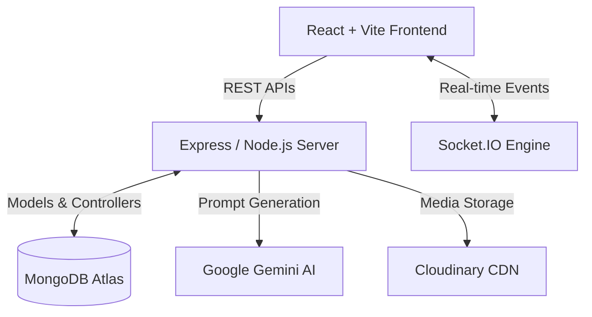

# 🍷 FlavorDash — AI-Powered Luxury Restaurant Ordering Platform

[](https://react.dev/)
[](https://vitejs.dev/)
[](https://nodejs.org/)
[](https://www.mongodb.com/)
[](https://socket.io/)
[](https://ai.google.dev/)
[](LICENSE)

FlavorDash is a luxury restaurant ordering, AI nutrition planning, and real-time delivery management platform built using modern MERN architecture. It offers a premium, high-end direct-to-consumer dining experience with multi-role access control for **Customers**, **Admins**, and **Delivery Drivers**.

---

## ✨ Key Features

### 🥗 Customer Portal & AI Nutrition
* **AI Meal Planner:** Tailored meal planning powered by **Google Gemini API** (with OpenAI fallback) based on user age, weight, goal, and dietary preferences—mapped directly to orderable menu items.
* **Luxury Menu Browsing:** Rich dish presentation, category filters, dish customization, detailed ingredients, and nutritional information.
* **Dynamic Shopping Cart:** Server-side pricing recalculation with custom taxes, subtotal calculation, and customizable line items.
* **Multi-Step Checkout:** Seamless checkout flow with address selection and payment confirmation.
* **Live Order Tracking:** Real-time Socket.IO order status updates and live driver location simulation.
* **Reviews & Ratings:** Dish and restaurant feedback system with user rating support.

### 📊 Admin Control Center
* **Operational Analytics:** Overview of system orders, user activity, revenue statistics, and platform status.
* **User & Role Management:** Ban/unban controls, role assignments (Customer, Delivery, Admin), and user auditing.
* **Order & Review Moderation:** Update order workflows, manage reviews, and resolve support inquiries.

### 🛵 Driver Delivery Hub
* **Delivery Job Management:** Browse available orders, accept jobs, and update delivery milestones (pickup, in transit, delivered).
* **Live Coordinate Broadcast:** Emits driver updates in real-time via Socket.IO to user order tracking screens.
* **Earnings & Performance:** Track total completed orders, ratings, and driver earnings.

### 🔐 Authentication & Infrastructure
* **Dual Auth System:** JWT access/refresh token pair with refresh token rotation + Google OAuth (Google Identity Services & Passport redirect flow).
* **Role-Based Middleware:** Strict server-side route authorization (`Customer`, `Delivery`, `Admin`).
* **Media Uploads:** Authenticated image uploads powered by **Cloudinary**.
* **Swagger API Docs:** Interactive REST documentation served natively at `/api-docs`.

---

## 🏗️ System Architecture



---

## 🛠️ Tech Stack

### Frontend
- **Framework:** [React 19](https://react.dev/) + [Vite 8](https://vitejs.dev/)
- **State & Routing:** React Context API (`AppContext`)
- **HTTP Client:** Axios (with automated refresh token interceptor)
- **Real-Time:** Socket.IO Client
- **Animations & Icons:** Framer Motion, Lucide React
- **Styling:** Custom Vanilla CSS Design System

### Backend
- **Runtime:** Node.js + Express.js
- **Database:** MongoDB with Mongoose ODM
- **Authentication:** Passport JWT, Google OAuth 2.0 (`google-auth-library`)
- **Real-Time Communication:** Socket.IO Server
- **AI Services:** `@google/generative-ai`, OpenAI API (Fallback)
- **Security:** Helmet, CORS Allowlist, Mongo Sanitize, XSS Clean, Rate Limiting
- **Documentation:** Swagger UI Express (`/api-docs`)

---

## 🚀 Quick Start Guide

### Prerequisites
- [Node.js](https://nodejs.org/) (v18+ recommended)
- [MongoDB](https://www.mongodb.com/) (Local instance or MongoDB Atlas URI)
- Google Gemini API Key (Optional for AI features)
- Cloudinary Credentials (Optional for image uploads)

---

### 1. Clone the Repository
```bash
git clone https://github.com/Madeswaranjv/RestaurantOrdering.git
cd RestaurantOrdering
```

### 2. Backend Setup
```bash
cd backend
npm install
```

Create a `.env` file inside the `backend` directory:
```env
PORT=5000
NODE_ENV=development
MONGO_URI=mongodb://localhost:27017/flavordash
JWT_SECRET=your_jwt_secret_key_here
JWT_REFRESH_SECRET=your_jwt_refresh_secret_key_here
GOOGLE_CLIENT_ID=your_google_client_id
GOOGLE_CLIENT_SECRET=your_google_client_secret
GEMINI_API_KEY=your_gemini_api_key
CLOUDINARY_CLOUD_NAME=your_cloudinary_cloud_name
CLOUDINARY_API_KEY=your_cloudinary_api_key
CLOUDINARY_API_SECRET=your_cloudinary_api_secret
FRONTEND_URL=http://localhost:5173
```

#### Seed Sample Data (Optional)
To populate the database with default luxury menu items, admin users, and sample driver accounts:
```bash
npm run seed
```

#### Start Backend Server
```bash
npm run dev
```
The backend API will run at `http://localhost:5000` and Swagger docs will be available at `http://localhost:5000/api-docs`.

---

### 3. Frontend Setup
Open a new terminal window:
```bash
cd frontend
npm install
```

Create a `.env` file inside the `frontend` directory:
```env
VITE_API_URL=http://localhost:5000/api
VITE_SOCKET_URL=http://localhost:5000
VITE_GOOGLE_CLIENT_ID=your_google_client_id
```

#### Start Frontend Dev Server
```bash
npm run dev
```
The application will launch at `http://localhost:5173`.

### 4. Desktop application (Electron)

The repository root contains the Electron shell. It runs the React interface in a native window and, in a packaged build, starts the Express API automatically.
Complete the backend and frontend dependency installs above before using these commands.

```bash
# From the repository root
npm install

# Development: starts API, Vite, and the Electron window together
npm run dev

# Build a Windows installer in release/
npm run dist
```

The packaged app never includes `backend/.env`. On its first launch it creates a safe `backend.env` template in its user-data folder and asks the user to configure the MongoDB URI, authentication secrets, and optional service keys. This keeps development credentials out of the distributable installer.

For a portable test build without an installer, use:

```bash
npx electron-builder --dir
```

---

## 📁 Repository Structure

```
RestaurantOrdering/
├── backend/
│   ├── config/             # DB & Passport Config
│   ├── controllers/        # Express API Controllers
│   ├── middleware/         # Auth, Role Guard, Security Middleware
│   ├── models/             # Mongoose Schemas & Models
│   ├── repositories/       # Data Access Layer
│   ├── routes/             # REST Endpoints
│   ├── services/           # AI, Email, Socket, and Media Services
│   ├── seeders/            # Demo Database Seeder Script
│   └── server.js           # Server Entrypoint & Socket.IO Setup
└── frontend/
    ├── src/
    │   ├── components/     # UI Components & Dashboards
    │   ├── context/        # App State & Authentication Provider
    │   ├── services/       # Centralized API Services (Axios)
    │   ├── pages/          # Application Views (Menu, Cart, Admin, Driver)
    │   ├── App.jsx         # App Root
    │   └── index.css       # Custom Design System Tokens & CSS
    └── package.json
```

---

## 📖 API Documentation

Once the backend is running, interactive REST documentation powered by Swagger can be accessed at:
👉 **`http://localhost:5000/api-docs`**

---

## 📄 License

Distributed under the MIT License. See `LICENSE` for more information.
